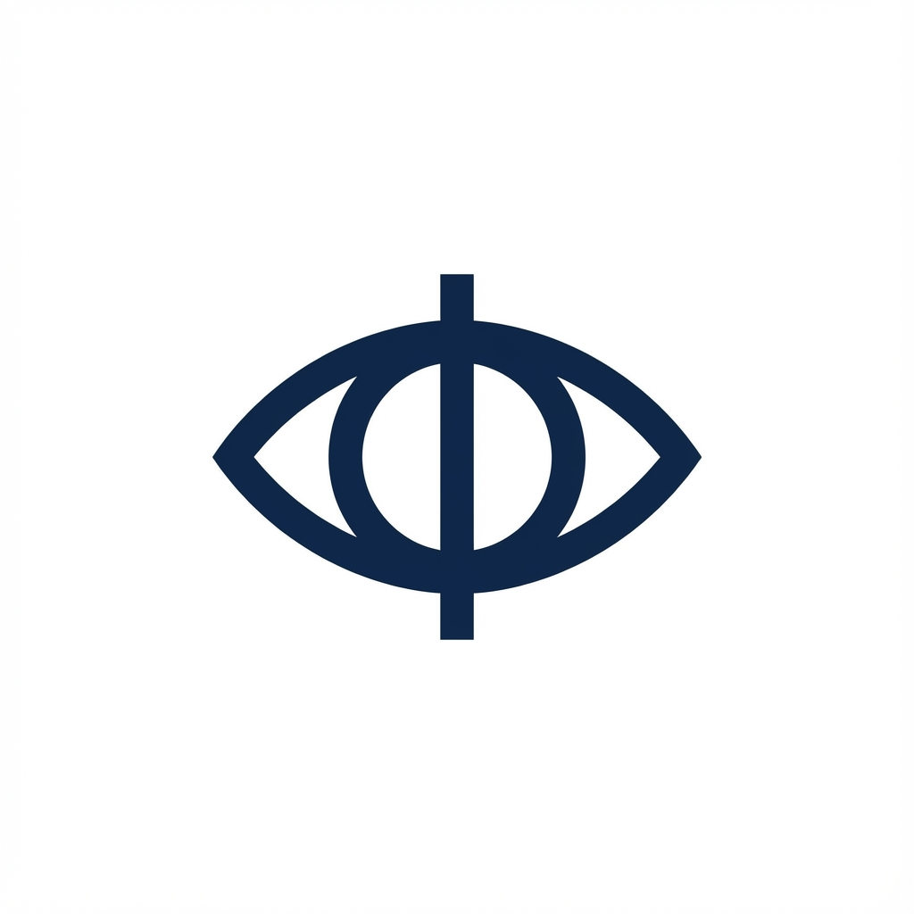
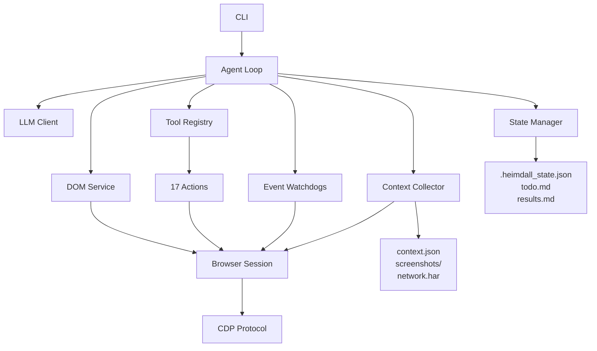

<div align="center">



# Heimdall

> Browser automation agent that executes natural language tasks and collects context for automation script generation.
</div>

## Installation

```bash
pip install heimdall
```

Or with uv:

```bash
uv add heimdall
```

## Quick Start

```bash
# Run a task
heimdall run "Login with user@example.com" --url https://example.com/login

# Show version
heimdall version
```

## Features

- 🌐 **Natural Language Tasks** - Describe what you want in plain English
- 🔧 **CDP-Based** - Direct Chrome DevTools Protocol control via `cdp-use`
- 📊 **Context Collection** - DOM, selectors, network, screenshots per action
- 🔄 **Language-Agnostic Output** - JSON format usable by any framework

## Architecture



## Documentation

- [Architecture](docs/architecture.md)
- [RFC](docs/rfc-001-heimdall.md)
- [PRD](docs/prd.md)

## Development

```bash
# Clone and install
git clone https://github.com/madanlalit/heimdall.git
cd heimdall
uv sync --dev

# Run tests
pytest

# Lint
ruff check src/

# Type check
uvx ty check
```

## License

MIT
