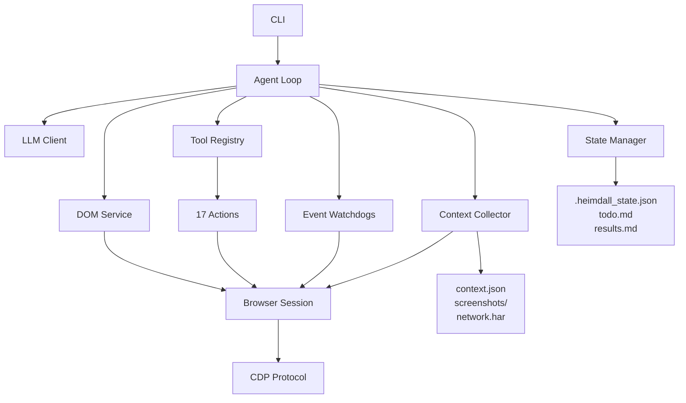

<div align="center">


<h1>Heimdall</h1>

<p><strong>Browser automation through natural language</strong></p>

<p>
  <a href="https://www.python.org/downloads/"></a>
  <a href="LICENSE"></a>
  <a href="https://chromedevtools.github.io/devtools-protocol/"></a>
</p>

</div>

<br/>

## Overview

Heimdall is a browser automation agent that executes natural language instructions and collects comprehensive context for automation script generation. Describe what you need in plain English—Heimdall handles the complexity.

```bash
heimdall run "Search for MacBook Pro and add the first result to cart" \
  --url https://example.com
```

<br/>

## Installation

```bash
pip install heimdall
```

Or with [uv](https://github.com/astral-sh/uv):

```bash
uv add heimdall
```

<br/>

## Usage

### Basic Task Execution

```bash
heimdall run "Fill out the contact form with test data" \
  --url https://example.com/contact
```

### With Browser Profile

```bash
heimdall run "Navigate to dashboard and export data" \
  --url https://app.example.com \
  --profile "Default"
```

### Custom Instructions

```bash
heimdall run "Complete the checkout process" \
  --url https://shop.example.com/cart \
  --instructions ./custom-context.txt
```

<br/>

## How It Works

Heimdall combines language models with browser automation to execute complex workflows:

1. **Parse** — Interprets natural language into structured actions
2. **Execute** — Performs browser actions via Chrome DevTools Protocol
3. **Observe** — Monitors network, DOM changes, and page state
4. **Collect** — Captures comprehensive context (selectors, screenshots, network traces)
5. **Export** — Generates language-agnostic JSON for script generation

<br/>

## Core Features

**Natural Language Interface**  
Describe tasks in plain English. No coding required.

**Context-Aware Execution**  
17 browser actions with intelligent waiting and error recovery.

**Comprehensive Data Collection**  
Every action captures DOM snapshots, selectors (CSS, XPath, ARIA, text), screenshots, and network activity.

**Language-Agnostic Output**  
JSON format compatible with Playwright, Selenium, Cypress, Puppeteer, and any automation framework.

**Resumable Tasks**  
State persistence enables long-running workflows with automatic recovery.

**Browser Profile Support**  
Use existing Chrome profiles to preserve authentication and cookies.

<br/>

## Architecture



<br/>

## Documentation

- [Technical RFC](docs/rfc-001-heimdall.md) — Architecture and design decisions
- [Product Requirements](docs/prd.md) — Vision, goals, and roadmap

<br/>

## Development

```bash
# Clone repository
git clone https://github.com/madanlalit/heimdall.git
cd heimdall

# Install dependencies
uv sync --dev

# Run tests
pytest

# Lint and type check
ruff check src/
uvx ty check
```

<br/>

## License

MIT © [madanlalit](https://github.com/madanlalit)

<br/>

<div align="center">
  <sub>Built with <a href="https://github.com/browser-use/cdp-use">cdp-use</a></sub>
</div>

