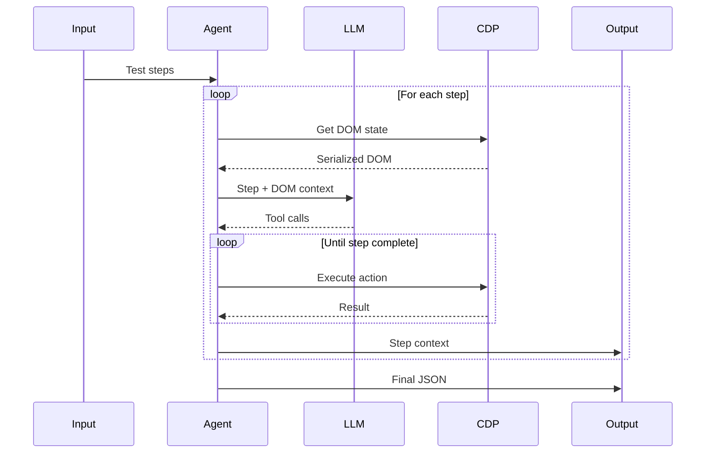

# RFC-001: Heimdall - Browser Test Context Collector Agent

| Field | Value |
|-------|-------|
| **Status** | Draft |
| **Author** |  Team Heimdall |
| **Created** | 2025-12-23 |
| **Updated** | 2025-12-23 |

---

## Summary

Heimdall is a testing-focused browser automation agent that executes test steps via LLM-driven browser interaction using CDP (Chrome DevTools Protocol). It collects comprehensive context data for each step in a language-agnostic format, enabling generation of automation scripts in any language/framework (Playwright, Selenium, Cypress, etc.).

---

### Problem Statement

Creating robust UI automation scripts requires:

1. **Reliable selectors** - Multiple selector strategies (CSS, XPath, data-testid, aria)
2. **Context awareness** - DOM state, network calls, visual state
3. **Manual effort** - Developers manually inspect elements and write tests

### Proposed Solution

An agent that:

1. Takes natural language tasks as input (it can be test steps or any other task)
2. Executes them in a real browser via CDP (Chrome DevTools Protocol)
3. Collects all context needed for automation (selectors, network, screenshots) and stores it in a language-agnostic format
4. Outputs language-agnostic JSON that can generate scripts in any framework (Playwright, Selenium, Cypress, etc.)

---

## Design

### High-Level Architecture

```
┌─────────────────┐     ┌─────────────────┐     ┌─────────────────┐
│   Test Input    │────▶│   Agent Loop    │────▶│  JSON Output    │
│   (YAML/JSON)   │     │   (LLM + CDP)   │     │  + Artifacts    │
└─────────────────┘     └─────────────────┘     └─────────────────┘
                               │
                               ▼
                        ┌─────────────────┐
                        │   Chrome CDP    │
                        │   (cdp-use)     │
                        └─────────────────┘
```

### Core Components

| Component | Responsibility |
|-----------|----------------|
| **Browser Session** | Wraps `cdp-use` CDPClient, manages connection |
| **EventBus** | Lightweight pub/sub for loose coupling |
| **Watchdogs** | Navigation, Network, DOM, Error monitoring |
| **DomService** | Extracts DOM via parallel CDP calls, serializes for LLM |
| **Tools Registry** | Defines browser actions (click, type, navigate) |
| **Agent Loop** | Orchestrates LLM calls with DOM context |
| **Demo Mode** | Element highlighting + floating tooltips |
| **Persistence** | State management for long-running tasks |
| **Logging** | Structured Rich console logging |
| **Collector** | Aggregates step context for output |

### Technology Stack

| Layer | Technology |
|-------|------------|
| CDP Client | `cdp-use` (type-safe CDP from browser-use) |
| LLM | OpenAI / Anthropic (tool calling) |
| EventBus | Custom (~100 lines, NOT bubus) |
| Models | Pydantic v2 |
| CLI | Typer |
| Logging | Rich |

---

## Technical Specification

### Input Format

Natural language tasks

### Output Format (Language-Agnostic)

JSON

### Agent Flow



### DOM Extraction (5-Stage Pipeline)

Following browser-use patterns:

1. **Parallel CDP Calls**
   - `DOMSnapshot.captureSnapshot`
   - `Accessibility.getFullAXTree`
   - `Page.getLayoutMetrics`

2. **Tree Construction** - Merge DOM + AX + Layout

3. **Filtering** - Visible/interactive elements only

4. **Serialization** - Index assignment, LLM-friendly format

5. **Selector Generation** - Multiple strategies per element

---

## API Reference

### CLI

```bash
# Run test file
heimdall run test.yaml --output ./results

# Run with specific LLM
heimdall run test.yaml --llm openai --model gpt-4

# Run in headed mode (visible browser)
heimdall run test.yaml --headed

# Generate scripts from output
heimdall generate results/output.json --framework playwright
```

### Python API

```python
from heimdall import Agent, BrowserSession

async def main():
    session = await BrowserSession.launch(headless=True)
    agent = Agent(session=session, llm="openai")
    
    result = await agent.run("tests/login.yaml")
    result.export("output/")
```

---

## Implementation Phases

| Phase | Scope | Deliverable |
|-------|-------|-------------|
| **1** | Browser Session | CDP connection, basic commands |
| **2** | EventBus + Watchdogs | Event system, navigation/network/dom/error monitors |
| **3** | DOM Service | Extraction, serialization |
| **4** | Tools | click, type, navigate, scroll |
| **5** | Agent Loop | LLM integration, step execution |
| **6** | Logging | Structured Rich console output |
| **7** | Demo Mode | Element highlighting, tooltips |
| **8** | Persistence | State, todo.md, results.md |
| **9** | Collector + CLI | Context capture, JSON export, entry point |

---

## Open Questions

1. **LLM Provider Default**: OpenAI or Anthropic as default?
2. **Selector Priority**: Which selector strategy should be primary?
3. **Max Retries**: How many retries on failed actions?
4. **Network Capture Scope**: All requests or filtered by domain?
5. **Screenshot Format**: PNG or WebP?

---

## Risks & Mitigations

| Risk | Mitigation |
|------|------------|
| CDP version changes | Pin cdp-use version, test on updates |
| LLM hallucinations | Validate tool calls against DOM state |
| Dynamic content | Wait strategies, DOM stability checks |
| Large DOMs | Filter to interactive elements only |

---

## Success Criteria

- [ ] Can execute multi-step test flow successfully and reliably
- [ ] Captures network requests during flow
- [ ] Multiple selector strategies per element
- [ ] < 5s overhead per step (excluding network)

---

## References

- [browser-use](https://github.com/browser-use/browser-use) - Architecture inspiration
- [cdp-use](https://github.com/browser-use/cdp-use) - Type-safe CDP client
- [Chrome DevTools Protocol](https://chromedevtools.github.io/devtools-protocol/)
